# **Optifi \- AI Financial Coach** **Design Documentation**

DEMO: https://www.youtube.com/watch?v=PjrtHv9MCA8

## **Problem Statement:**

Many people struggle with personal finance due to a lack of visibility and personalized, actionable advice. Manually tracking every expense is tedious, and generic budgeting apps often fail to inspire lasting behavioral change. As a result, people are often unaware of wasteful spending habits, miss opportunities to save, and feel anxious about their financial future.

## **1\. Design Overview**

Optifi is an AI-powered financial intelligence platform designed to provide personalized, actionable insights to young adults, gig workers, and anyone who wants to get a grip of their finances. The system ingests raw transaction data and uses a hybrid approach of deterministic rules and Generative AI to offer financial insights, anomaly detection, subscription detection, goal forecasting, and on-demand data visualization. Users can interact with an AI Financial Coach via text chat and get insights to their spending, budgeting, and saving goals and use natural language to generate data visualizations of their finances.

### **1.1 Architecture Diagram**

```mermaid
graph LR
    %% Styling
    classDef client fill:#e3f2fd,stroke:#1565c0,stroke-width:2px,color:#0d47a1,rx:10px,ry:10px;
    classDef flask fill:#e8f5e9,stroke:#2e7d32,stroke-width:2px,color:#1b5e20,rx:10px,ry:10px;
    classDef ai fill:#f3e5f5,stroke:#7b1fa2,stroke-width:2px,color:#4a148c,rx:5px,ry:5px;
    classDef data fill:#fff3e0,stroke:#e65100,stroke-width:2px,color:#e65100,rx:10px,ry:10px,shape:cylinder;
    classDef external fill:#eeeeee,stroke:#616161,stroke-width:2px,color:#212121,rx:5px,ry:5px;

    User([👤 User]) <-->|Interacts via Web UI| Client

    subgraph Client ["🖥️ Frontend (React)"]
        UI[User Interface]
        Viz[Recharts Visualization]
        State[State Management]
    end

    Client <-->|JSON / HTTP Requests| API

    subgraph Backend ["⚙️ Backend (Flask API)"]
        API[API Routes / Controller]

        subgraph Hybrid_AI ["🧠 Hybrid AI Layer"]
            LocalML["Local ML Engine (ai_engine.py)
            (Pandas / Scikit-Learn)
            Goal: Anomaly Detection & Hard Stats"]

            GenAI_Client["GenAI Integration
            (Goal: Conversational, Forecasting,
            Viz Config, Subscription Detection)"]
        end

        DataLoader["In-Memory Data Loader"]
    end

    DataLoader <-->|Reads on Startup| CSV[(Transaction Data CSV)]

    API <-->|Process Math/Stats| LocalML
    API <-->|Generate Natural Language/Reasoning| GenAI_Client
    GenAI_Client <-->|External API Call| Gemini[✨ Google Gemini API]
    API <--o|Query Data| DataLoader

    %% Apply classes
    class UI,Viz,State client;
    class API,DataLoader flask;
    class LocalML,GenAI_Client ai;
    class CSV data;
    class Gemini external;
```

## **2\. Tech Stack**

| Component           | Technology                                                                    | Rationale                                                                                                                                                                                        |
| :------------------ | :---------------------------------------------------------------------------- | :----------------------------------------------------------------------------------------------------------------------------------------------------------------------------------------------- |
| **Frontend**        | React.js, Tailwind CSS, Recharts, Lucide React                                | Rapid UI development with pre-built components and responsive design. Recharts offers easy integration for data visualization.                                                                   |
| **Backend**         | Flask (Python)                                                                | Lightweight, minimal boilerplate, and seamless integration with Python data science libraries.                                                                                                   |
| **Data Processing** | Pandas, NumPy                                                                 | High-performance in-memory data manipulation for statistical analysis and anomaly detection.                                                                                                     |
| **AI Engine**       | Google Gemini API (gemini-flash-latest)    Category-level Isolation Forest Model | Fast inference speeds suitable for real-time chat and structured JSON generation.    Suitable for the time constraints. Doesn’t require labeled datasets. Input raw data and get immediate results. |
| **Data Storage**    | CSV (Read-Only) \+ In-Memory Python Objects                                   | Zero-setup "database" for immediate read access, prioritizing speed over persistence.                                                                                                            |

## **3\. Key Features**

1. **Conversational AI Coach (“Optimus”)**
   1. **Context-Aware Chat:** Optimus understands the user’s full financial picture, including recent transactions, income stability (gig vs. salaried), and active goals.
   2. **Behavioral Nudges**: Instead of just listing data, the AI offers encouraging, non-judgmental tips to improve spending habits (e.g. “Cutting back on coffee this week could save you $20”).
2. **ML-Powered Anomaly Detection**
   1. **Unsupervised Learning:** Uses an Isolation Forest model (via Scikit-learn) to automatically learn a user’s “normal” spending baseline per category.
   2. Uses GenAI to convert ML results to easily understandable financial insights.
   3. Flags unusual transactions without requiring manual threshold setup by the user.
3. **Natural Language Visualization**
   1. **On-Demand Charts:** Users can generate complex visualizations just by asking (e.g. “Show me a pie chart of my food spending last month”).
   2. **Dynamic Rendering:** The backend translates text prompts into raw JSON configurations using a LLM, which the frontend renders instantly using Recharts.
4. **Subscription & “Gray Charge” Detection**
   1. **GenAI Forensics:** Goes beyond simple vendor name matching. The AI analyzes transaction patterns, amounts, and merchant names to identify forgotten free trials, irregular recurring charges, and standard subscriptions.
   2. **Actionable List:** Presents a clean, unified list of potential cancellations to free up monthly cash flow.
5. **Smart Goal Forecasting**
   1. **Feasibility Analysis:** Users can set concrete goals (e.g. “Save $2000 by February”). The system analyzes their current savings rate and income consistency to predict if they are on track.
   2. **Reality Checks:** If a goal is at risk, the AI provides a realistic, mathematically-grounded adjustment (e.g. “You need to save an extra $15/day to hit this target”).

## **4\. Key Modules & Design Decisions**

### **4.1 Financial Intelligence Engine**

Before data reaches the LLM, it is processed deterministically to provide grounded context.

1. Income Classifier (detect_income_type):
   1. Uses Pandas to calculate standard deviation of time gaps between deposits
   2. Classifies users as “gig” (high variance in gap/amount) vs. “recurring” (low variance)
   3. Why: Freelancers/gig employees need different advice than salaried employees.
2. Anomaly Detection (Category-level Isolation Forest ML Model and Z-score)
   1. Uses Isolation Forest, an unsupervised learning algorithm ideal for detecting statistical anomalies in high-dimensional datasets.
   2. Uses Z-score as a backup to catch massive outliers in high-variance categories.
   3. Creates rolling 7-day means, percentage changes, and time indices per category to help the model understand “norma” spending patterns vs. sudden spikes.

### **4.2** **Generative AI Layer (Gemini Personas)**

Interprets the deterministic data provided by the financial intelligence engine into human-friendly financial insights, detects nuanced patterns like “gray charges” based on vendor names, and translates natural language into structured chart configurations. The system uses distinct system prompts to create specialized AI “agents”:

1. The Coach: Friendly, non-judgemental persona for general chat and insights.
2. The Forensic Accountant: Specialized prompt optimized for high-recall detection of subscriptions and “gray charges”.
3. The Visualizer: Converts natural language requests (e.g. “Show me my food spending trend as a line graph”) into strict JSON configurations for frontend charting libraries.

### **4.3 Conversational Interface (/api/chat)**

4. Uses a two-stage approach for better accuracy:
   1. **Regex pre-processing** (extract_goal_from_message): Deterministically extracts concrete data like dollar amounts and target dates (e.g., “save $3000 by May”) using regular expressions and dateparser.  
      2. **LLM Reasoning:** If a goal is detected deterministically, it is passed as structured context to Gemini to generate the conversational response and feasibility forecast.
5. **Context Management**: Maintains a short-term, in-memory chat history per session ID to allow for multi-turn conversations.
6. **Intent Recognition**: Uses regex to pre-extract concrete goals (amounts and dates) from user messages before passing them to the LLM for feasibility analysis.
7. **Performance Optimization**: Limits context window to the last 5 messages to balance coherence with token usage and latency.

### **4.4 Dynamic Visualization**

8. **Text-to-Chart:** A specialized Gemini system prompt converts user requests (e.g., “show my coffee spending”) into a strict JSON format compatible with the frontend’s Recharts library.
9. **Frontend Rendering**: The React app dynamically selects the chart component (Pie, Bar, Line) based on the AI-generated configuration.

## **5\. Tradeoffs**

| Decision                   | Benefit                                                                          | Drawback                                                                                                   |
| :------------------------- | :------------------------------------------------------------------------------- | :--------------------------------------------------------------------------------------------------------- |
| **In-Memory Data**         | Sub-100ms read speeds; instant startup.                                          | Data is lost on restart; does not scale beyond available RAM. Requires server restart to update base data. |
| **CSV Storage**            | Simple to edit and debug manually.                                               | No ACID compliance; poor performance for concurrent writes (not applicable here).                          |
| **Regex Intent Detection** | Fast and predictable for specific formats.                                       | Brittle; fails on unexpected phrasing that an NLP model might catch.                                       |
| **Isolation Forest**       | Effective at finding non-linear anomalies without needing labeled training data. | Can be noisy on small datasets, occasionally flagging normal variable spending as anomalous.               |

## **6\. Future Enhancements**

1. Database: Move from CSV to PostgreSQL for robust data persistence and multi-user support
2. Live Banking API: Integrate Plaid to fetch real-time transaction data instead of static CSV uploads.
3. User Authentication: Implement OAuth2/JWT to secure user sessions and data.
4. Advanced ML Models: Train custom classifier models for more accurate transaction categorization specific to user behavior.
5. Refine LLM Agent Prompts: Iterate on system prompts to improve reliability and persona consistency.

## **7\. Security Considerations**

1. API Key Management: API keys are stored in environment variables, keeping them out of the code base.
2. Data Privacy: Currently raw transaction data are sent to Gemini. In a production environment, Personally Identifiable Information (PII) must be scrubbed or hashed before transmission to any third-party service.
3. Input Validation: While basic validation is present, robust sanitization is needed on all chat inputs to prevent potential prompt injection attacks.

## **8\. Known Limitations**

1. Single User: The current architecture loads one global dataset. Simultaneous users would see the same data.
2. Immutable Dataset: Transaction data is pre-loaded for demonstration purposes and cannot be modified, uploaded, or deleted by the user at runtime.
3. Session Volatility: Sessions are non-persistent. Refreshing the browser or restarting the server will clear the chat history and any active visualizations.
4. API Dependencies: Core AI features rely on external LLM providers and are subject to their standard rate limits and throughput constraints.

## **9\. Ethical Considerations**

1. Data Sensitivity & LLM Leaks
   1. Risks: Even if anonymized, transaction patterns can be uniquely identifying. There is also the risk of LLM hallucinating a transaction that didn’t happen, causing user panic.
2. Over-reliance on automated systems
   1. Risks: If Optimus fails to flag a genuinely fraudulent transaction because it looked mathematically similar to a normal one, the user might not check their statement themselves, believing that Optimus has it handled.
3. Algorithmic Bias in Anomaly Detection
   1. Risks: if a user consistently makes poor financial decisions, the model will learn this as “normal” and stop flagging it.
  
## **10\. Key Learnings**

1. Relying solely on LLMs for financial math is risky. Combining deterministic ML with Generative AI provides a much more reliable and trustworthy user experience than using either in isolation.
2. Being agile and pivoting when an idea doesn't pan out.
3. Being mindful of scope creep especially given the time constraints.
4. Structured outputs are essential for GenAI. Forcing Gemini to return strict JSON for visualizations and subscription detection was critical for integration with the frontend
5. Limiting context window was a necessary trade-off between maintaining conversation coherence and managing latency/token costs.
6. Rate limits get blow through very quick when working with LLMs. Important to use mock data to avoid wasting tokens in unnecessary LLM calls.
7. Prioritization as a one-man team. Cutting corners intelligently. Prioritizing the user-facing features first for a MVP.
8. Shipping a working end-to-end pipeline that demonstrates the concept is more important than fine-tuning a model for 1% better accuracy in a hackathon setting.
